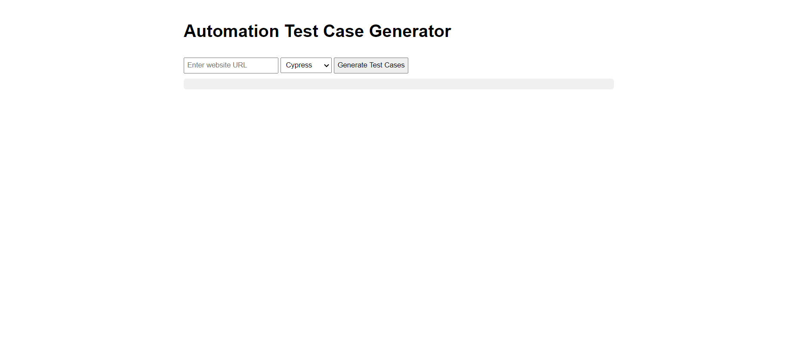
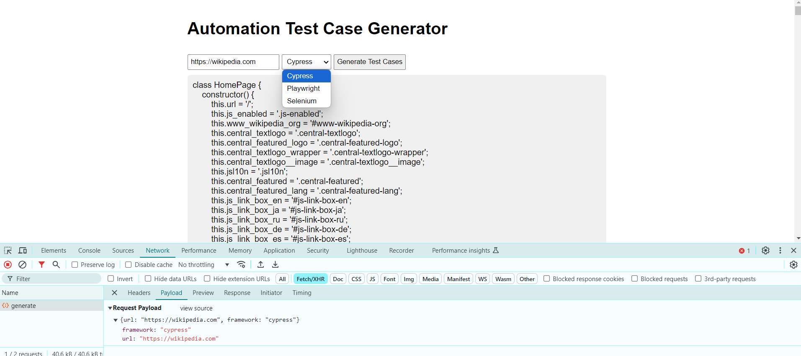

# WebCrawler-POM

This project allows you to crawl any website (not password-protected) and generate its Page Object Model (POM) with locators and functions.

## Table of Contents

- [WebCrawler-POM](#webcrawler-pom)
  - [Table of Contents](#table-of-contents)
  - [Getting Started](#getting-started)
    - [Prerequisites](#prerequisites)
    - [Installation](#installation)
  - [Usage](#usage)
  - [Features](#features)
  - [Contributing](#contributing)
  - [Contact](#contact)

## Getting Started

Follow these steps to set up and run the project on your local machine.

### Prerequisites

- Node.js (Download and install from [nodejs.org](https://nodejs.org/))
- Git (optional, for cloning the repository)

### Installation

1. **Clone the project** (or download the ZIP file)

   ```bash
   git clone https://github.com/syedyousafraza/WebCrawler-POM.git
   cd WebCrawler-POM
   ```

2. **Install Dependencies**

   Navigate to the project directory and run:

   ```bash
   npm install
   ```

3. **Start the Backend Server**

   Go to the backend directory and start the server:

   ```bash
   cd backend
   node server.js
   ```

   The server will run at: `http://localhost:3000`

4. **Open the Frontend Interface**

   Open the `index.html` file in your preferred web browser.

## Usage

1. Ensure the backend server is running.
2. Open `index.html` in your web browser.
3. Enter the URL of any website that is not password protected.
4. Click the "Generate POM" button (or similar).
5. Wait for the crawling process to complete.
6. View and download the generated Page Object Model (POM) with locators and functions.

## Features

- Crawl any non-password-protected website
- Generate Page Object Model (POM) automatically
- Identify and extract locators for web elements
- Create functions for interacting with identified elements
- Easy-to-use web interface

## Contributing

Contributions are welcome! Please feel free to submit a Pull Request.

1. Fork the repository
2. Create your feature branch (`git checkout -b feature/AmazingFeature`)
3. Commit your changes (`git commit -m 'Add some AmazingFeature'`)
4. Push to the branch (`git push origin feature/AmazingFeature`)
5. Open a Pull Request


## Contact

Syed Yousaf Raza - [shahyousaf11@gmail.com]

Project Link: [https://github.com/syedyousafraza/WebCrawler-POM](https://github.com/syedyousafraza/WebCrawler-POM)


Screenshots

